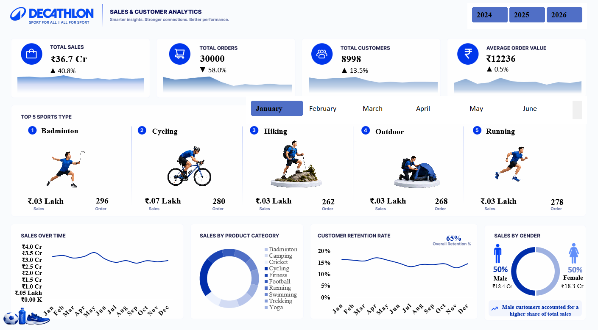

# DECATHLON SALES & CUSTOMER ANALYTICS 

An interactive **Business Intelligence Dashboard** built entirely in **Microsoft Excel** to analyze sales performance, customer behavior, product categories, and sports trends. The project combines **Power Query**, **Power Pivot**, **DAX**, and advanced Excel features to transform raw retail data into meaningful business insights.

---

## 📸 Dashboard Preview




---

## Project Overview

This project demonstrates an end-to-end analytics workflow using Microsoft Excel—from data cleaning and transformation to data modeling, KPI creation, and interactive dashboard design.

The dashboard allows users to explore sales performance dynamically using slicers and provides insights into customer retention, product category contribution, gender distribution, and top-performing sports.

---

## Tools & Technologies

- Microsoft Excel
- Power Query
- Power Pivot (Data Model)
- DAX (Data Analysis Expressions)
- Pivot Tables & Pivot Charts
- Dynamic Slicers
- XLOOKUP
- Excel IMAGE() Function
- GitHub-hosted Image Assets

---

## Dashboard Features

- Interactive KPI Cards
- Dynamic Year & Month Slicers
- Top 5 Sports Performance
- Sales Trend Analysis
- Product Category Analysis
- Customer Retention Analysis
- Gender-wise Sales Distribution
- Dynamic Sports Images using Excel IMAGE() and GitHub

---

## Key Insights

- Generated **₹36.7 Cr** in total sales.
- Processed approximately **30,000 orders** from **8,998 customers**.
- Average Order Value (AOV) is approximately **₹12,236**.
- Customer Retention Rate remains around **65%**, indicating a healthy repeat customer base.
- Product category analysis highlights the contribution of each sports segment to overall sales.
- Monthly filtering enables identification of seasonal demand and top-performing sports.

---

## DAX Measures Used

- Total Sales
- Total Orders
- Total Customers
- Average Order Value (AOV)
- Previous Year Sales
- Repeat Customers
- Customer Retention Rate

---

## Highlights

- End-to-end Excel Business Intelligence project.
- Built using Power Query, Data Model, and DAX.
- Interactive dashboard with dynamic slicers.
- Integrated GitHub-hosted sports images using Excel's `IMAGE()` function.
- Designed with a modern BI-inspired layout for an intuitive user experience.

---

## Repository Structure

```
📂 Decathlon-Sales-Customer-Analytics
│
├── Dataset/
│   └── Decathlon_Synthetic_Raw_Data.xlsx
|
├── Dashboard/
│   └── Decathlon_Sales_and_Customer_Analysis.xlsx
│
├── Dashboard Screenshot/
│   └── Dashboard.png
│
└── README.md
```

---

## Skills Demonstrated

- Data Cleaning & Transformation
- Data Modeling
- DAX Measure Creation
- Business Intelligence
- Dashboard Design
- KPI Reporting
- Data Visualization
- Retail Sales Analytics
- Customer Analytics
- Excel Automation

---

## Author

**Mohd Affan**

Email: <mohdaffan020@gmail.com>
